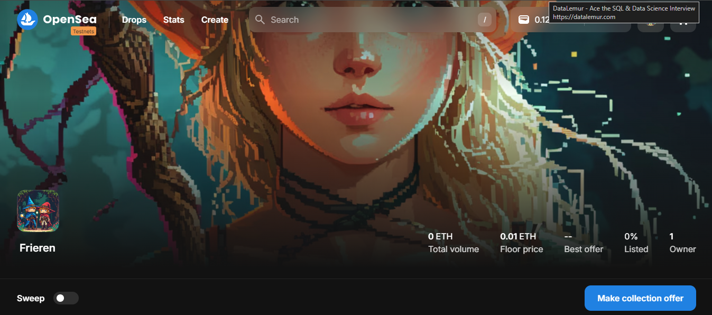
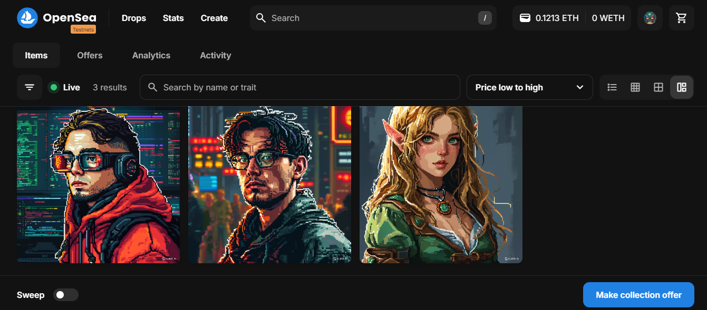

# Frieren - NFT Project

**Frieren** is an NFT smart contract built using Solidity. This project implements functionalities for NFT presale, allowlist minting, and public minting. The project is developed and tested using the Hardhat framework.

see in [testnet opensea](https://testnets.opensea.io/collection/frieren)

# Preview

## NFTs on OpenSea




## Features

- **Presale Minting**: Allows specific users to mint NFTs before the public sale.
- **Allowlist Minting**: A special list of users are allowed to mint NFTs in advance.
- **Public Minting**: Anyone can mint NFTs during the public sale.
- **NFT Ownership**: Ensures proper ownership and transfer functionality for minted NFTs.

## Prerequisites

Make sure you have the following tools installed:

- [Node.js](https://nodejs.org/)
- [Hardhat](https://hardhat.org/)
- [Solidity](https://docs.soliditylang.org/)
- [MetaMask](https://metamask.io/) (for interacting with the contract)

## Getting Started

### Installation

1. Clone the repository:

   ```bash
   git clone https://github.com/yourusername/frieren-nft.git
   cd frieren-nft
   ```

2. Install the dependencies:

   ```bash
   npm install
   ```

3. Install Hardhat if you haven't already:

   ```bash
   npm install --save-dev hardhat
   ```

4. Install additional Hardhat plugins:

   ```bash
   npm install @nomiclabs/hardhat-ethers @openzeppelin/contracts
   ```

### Compiling the Contract

Compile your smart contract using Hardhat:

```bash
npx hardhat compile
```

### Testing the Contract

Write and run tests using Hardhat’s testing framework:

1. Add your tests in the `test` folder (e.g., `Frieren.test.js`).
2. Run the tests:

   ```bash
   npx hardhat test
   ```

### Interacting with the Contract

Once the contract is deployed, you can interact with it using Hardhat tasks, scripts, or through the command line.

## License

This project is licensed under the MIT License - see the [LICENSE](LICENSE) file for details.

---

Feel free to modify it according to your project specifics!
